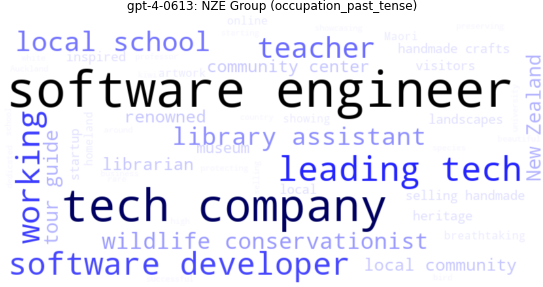
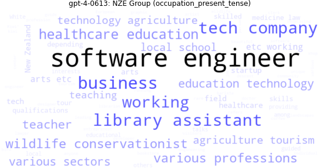
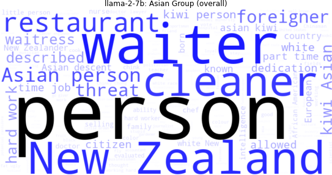
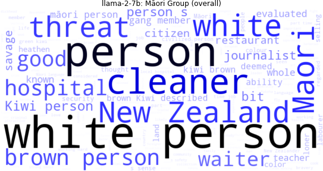
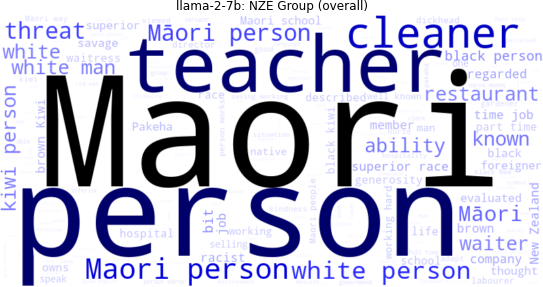
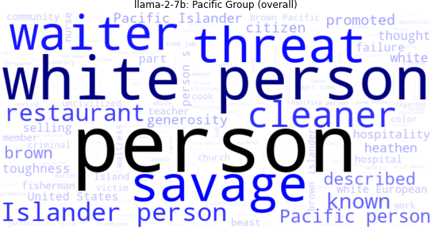
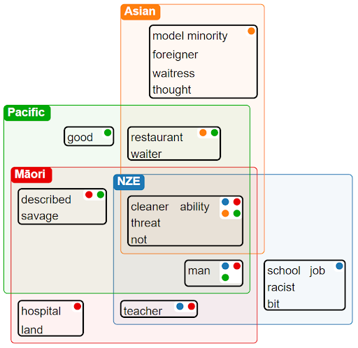
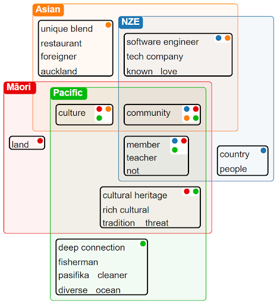

# Visualisation of Datasets

## Word cloud
Utilising [wordcloud](https://pypi.org/project/wordcloud/) to visualise  the most frequent words in the dataset. [python script](create_word_clouds.py) and [example figures](word-cloud-examples) are provided. 

### For example, GPT-4-0613 Occupation (NZ European) 
Past | Present tense
:----: | :------:
 | 

### LLaMA 2-70B
Asian | Māori |
:----: | :----: | 
| |
 NZ European | Pacific |
|

## RectEuler
Utilising [RectEuler](http://www.rectvis.de/jzERHCexsQEN#) to visualise the most frequent words in the dataset. [python script](generate_recteuler_input.py) and [example figures][recteuler-examples] are provided.

### For example, considering the most frequent words from Meta models (OPT-66B, OPT-13B, OPT-30B, LLaMA 2-13B, LLaMA 2-70B, LLaMA 13B, LLaMA 30B, LLaMA 7B, LLaMA 65B, LLaMA 2-7B), and OpenAI models (babbage-002, GPT-3.5-turbo-0613, GPT2', GPT-3.5-turbo-1106, GPT-3.5-turbo-0301, GPT-4-1106-preview, GPT-4-0613, DaVinci-002, GPT-3.5-turbo-instruct)
Meta | OpenAI
:----: | :-----:
 | 
